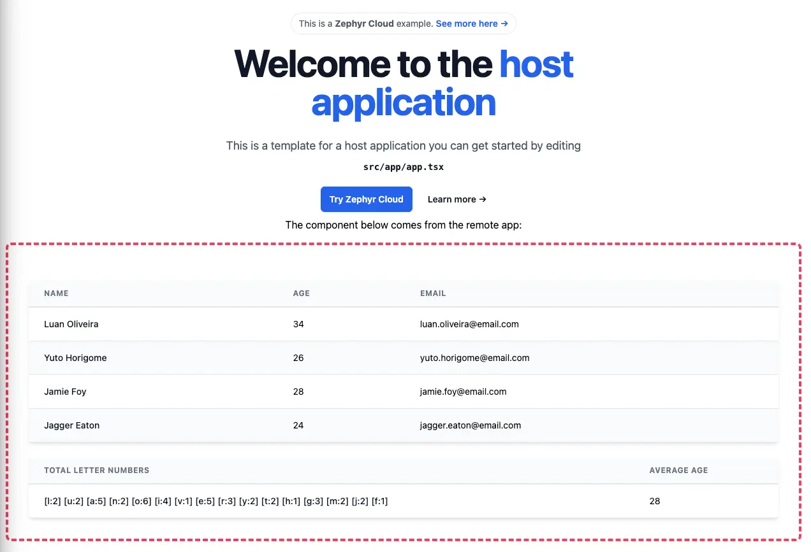

# Zephyr Interview Challenge

Powered by <a alt="Nx logo" href="https://nx.dev" target="_blank" rel="noreferrer"></a>

This is a small challenge to showcase one's ability to debug issues around the bundling process, styling configuration, federated applications, testing, among some other things.

There are several problems with this repository which the candidate must debug, research and resolve.

To get started you must first clone this repository:

```bash
git clone git@github.com:ryok90/zephyr-interview.git
```

Install the dependencies

```bash
pnpm i
```

And run the host application:

```bash
npx nx run host:serve
```

The complete resolution of the application must look something like this:



Good luck!
